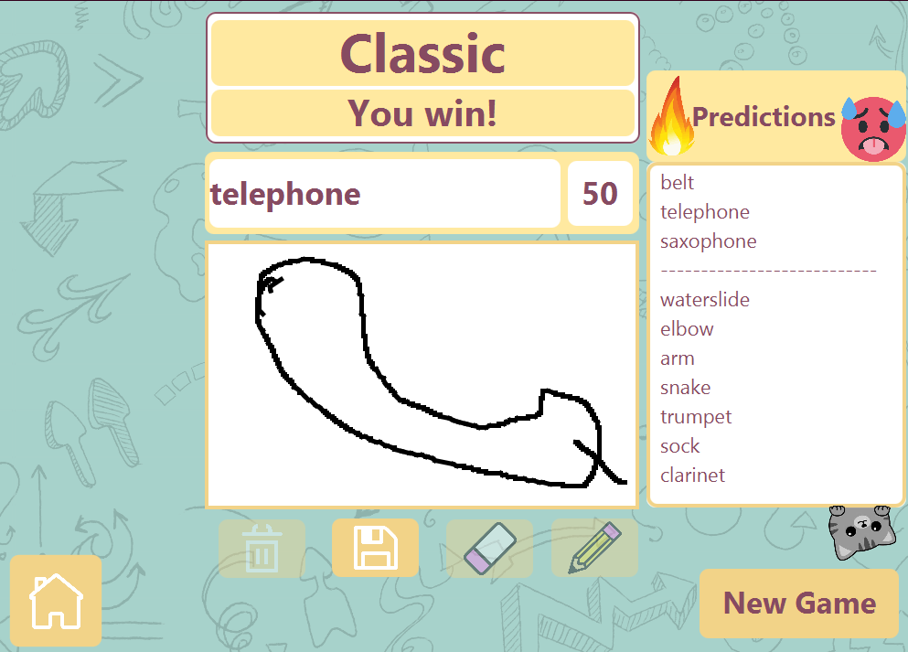
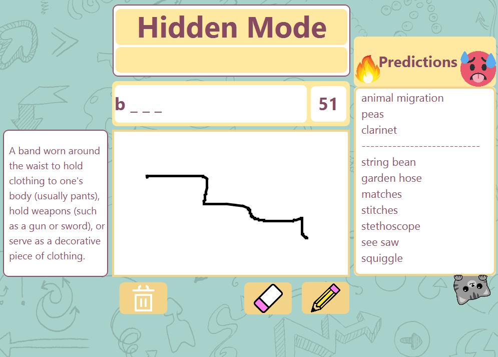
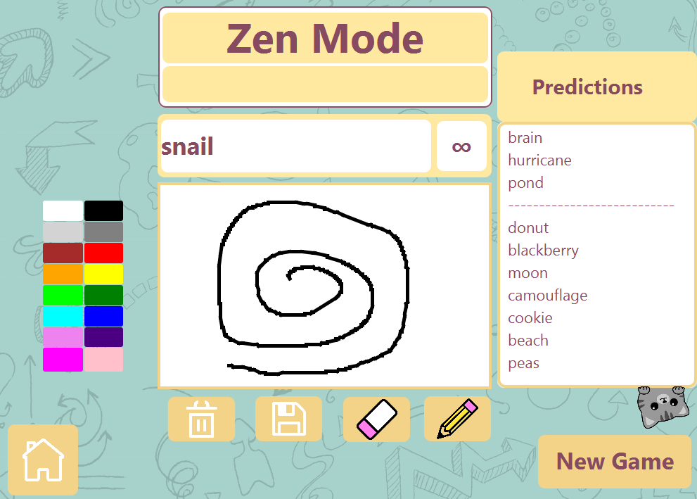
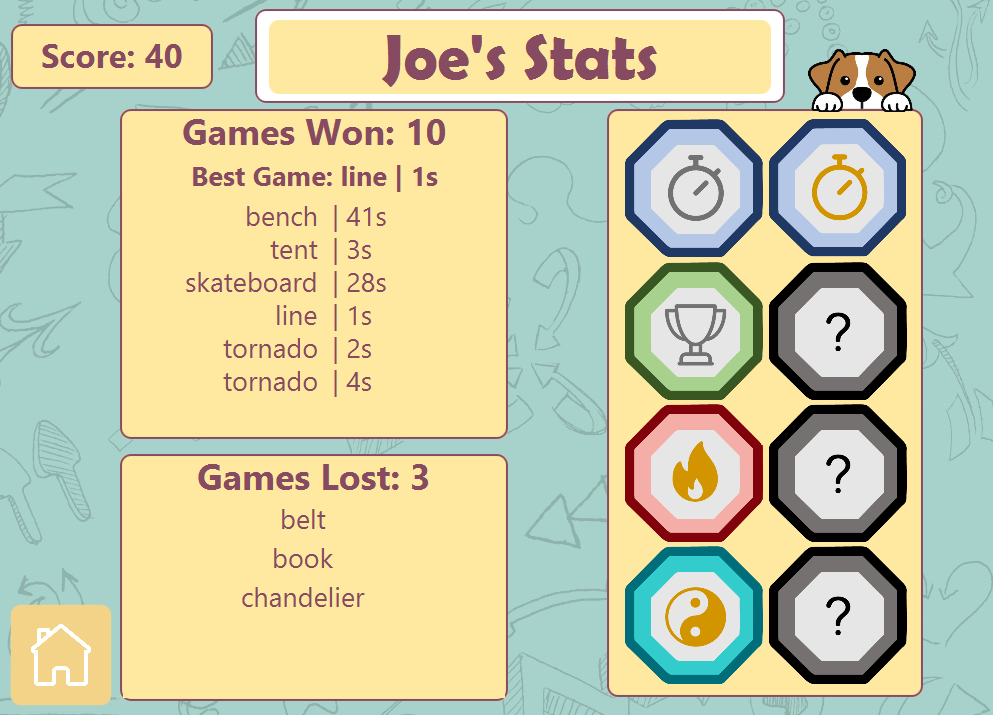
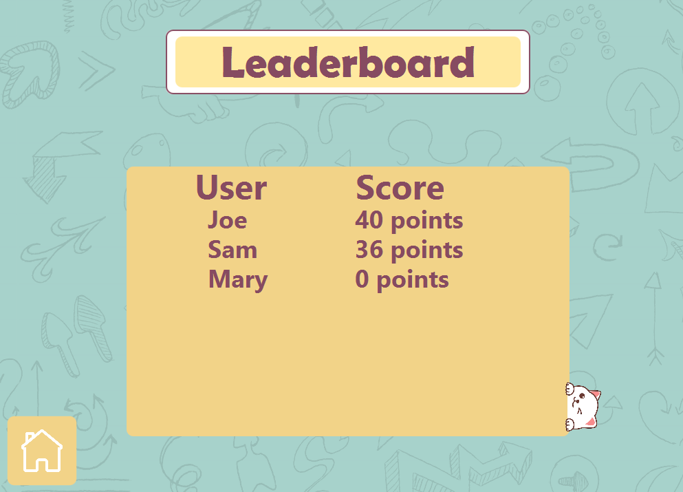

# Quick, Draw!
### Welcome to Quick, Draw!

Based on the [Google Quick Draw](https://quickdraw.withgoogle.com/) machine learning algorithm, this fun app is designed to improve the speed drawing skills of young children

Includes support for various gamemodes and multiple profiles

  
## Gameplay
- **Classic** - Draw the word in the allocated time!
- **Hidden** - Guess the word before drawing!
- **Zen** - No restrictions, maximum fun

  
  
  
  
## Stats and Leaderboard
- Unlock badges for playing
- Compete against family and friends

  

    
    
  

## Requirements
- [Java Runtime Environment (JRE)](https://www.oracle.com/java/technologies/javase-jre8-downloads.html)
- [Java JDK 17.0.2+](https://www.oracle.com/java/technologies/javase/jdk17-archive-downloads.html)

## Run the game!

Unix/MacOS:  
`./mvnw clean javafx:run`

Windows:  
`.\mvnw.cmd clean javafx:run`
